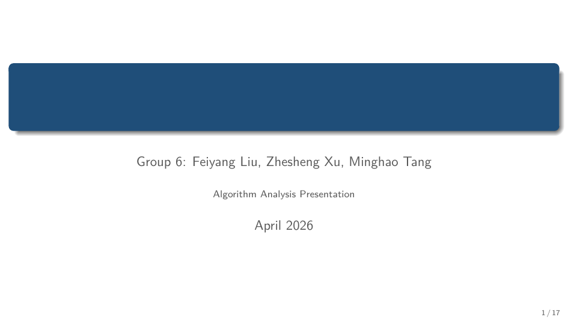
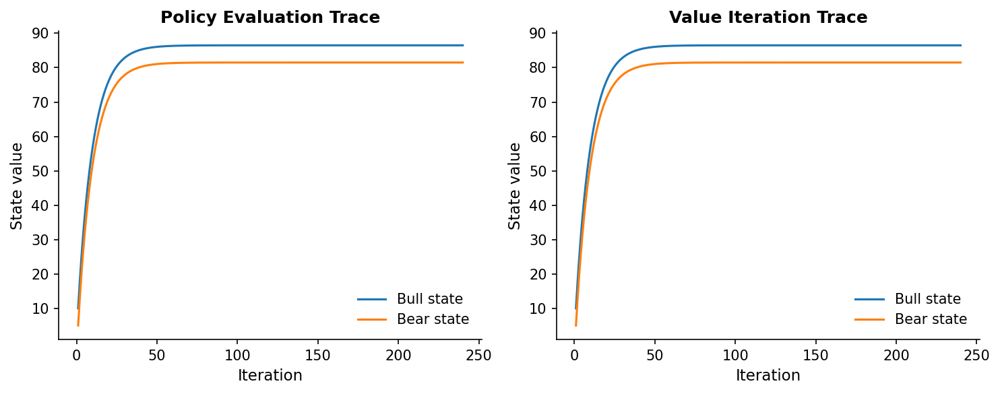
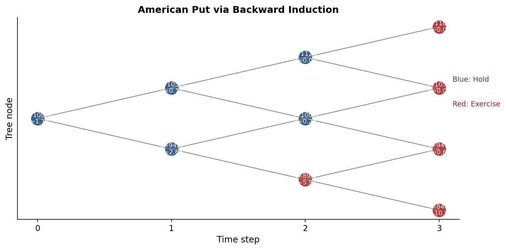
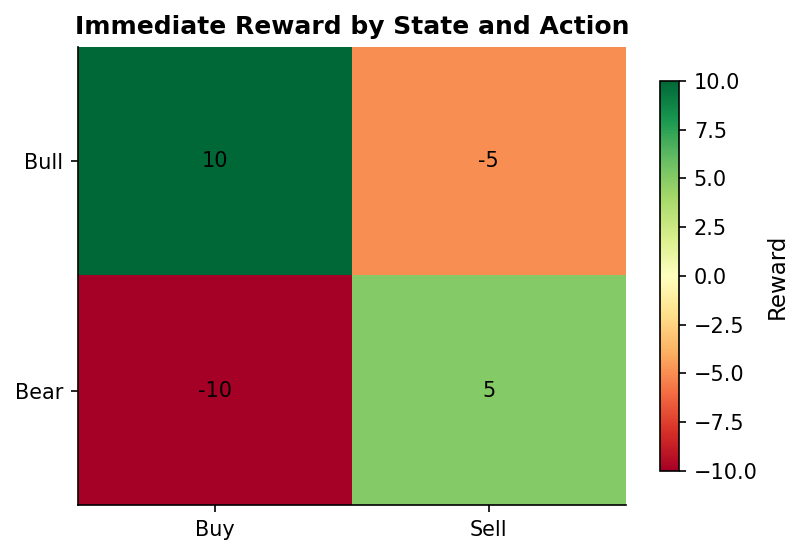

# 动态规划与马尔可夫决策过程｜Dynamic Programming and Markov Decision Processes

<p align="center">
  
</p>

<p align="center">
  <a href="#zh-cn">
    
  </a>
  <a href="#english">
    
  </a>
</p>

---

<a id="zh-cn"></a>

## 简体中文

<p>
  <strong>当前语言：</strong>中文 | <a href="#english">Switch to English</a>
</p>

这是一个围绕“动态规划、马尔可夫结构、贝尔曼方程、金融应用案例”重建后的展示型项目。仓库已经从原始粗稿整理为一个可维护、可演示、可继续扩展的完整项目，包含代码、LaTeX Beamer 幻灯片、逐页演讲稿，以及配套图表与导出结果。

### 项目预览

<p align="center">
  
  
</p>

### 仓库结构

- `src/mdp_presentation/`：核心 Python 包，包含模型定义、动态规划算法、案例构造、绘图和结果导出。
- `slides/main.tex`：重写后的 LaTeX Beamer 幻灯片源码。
- `speech/talk_script.md`：与新幻灯片逐页对齐的英文讲稿。
- `assets/figures/`：README 和幻灯片使用的生成图像。
- `output/`：生成的表格、摘要和编译输出。
- `legacy/`：归档后的原始粗稿材料，不再作为主工程结构的一部分。

### 主要内容

当前项目围绕两个教学案例组织：

1. 两状态金融交易 MDP，使用 `policy iteration` 和 `value iteration` 求解最优策略。
2. 三步美式看跌期权，使用二叉树上的 backward induction 求解决策与定价。

### 运行方式

生成图表、摘要和导出文件：

```powershell
python main.py
```

运行一个带标题的终端演示脚本：

```powershell
python pre.py
```

编译 Beamer 幻灯片：

```powershell
Set-Location slides
pdflatex -interaction=nonstopmode -halt-on-error -output-directory ..\output\slides main.tex
```

如果需要目录、页码和交叉引用稳定，建议运行两次。编译后的 PDF 位于 `output/slides/main.pdf`。

---

<a id="english"></a>

## English

<p>
  <strong>Current language:</strong> English | <a href="#zh-cn">切换到中文</a>
</p>

This repository is a rebuilt presentation project on dynamic programming, Markov structure, Bellman equations, and finance-oriented examples. The original draft material has been reorganized into a maintainable structure with clean code, a LaTeX Beamer deck, a slide-aligned speech script, and supporting figures and exported outputs.

### Project Preview

<p align="center">
  
  
</p>

### Repository Structure

- `src/mdp_presentation/`: core Python package for models, dynamic programming algorithms, worked examples, plotting, and reporting.
- `slides/main.tex`: rebuilt LaTeX Beamer presentation source.
- `speech/talk_script.md`: natural English speaker script aligned slide by slide.
- `assets/figures/`: generated figures used by the deck and the README.
- `output/`: generated tables, summaries, and compiled artifacts.
- `legacy/`: archived rough-draft material from the original repository.

### Main Content

The project is centered around two teaching examples:

1. A two-state trading MDP solved with policy iteration and value iteration.
2. A three-step American put option solved by backward induction on a binomial tree.

### How to Run

Generate figures, summaries, and exported assets:

```powershell
python main.py
```

Run the terminal demo entry with a presentation title:

```powershell
python pre.py
```

Compile the Beamer slides:

```powershell
Set-Location slides
pdflatex -interaction=nonstopmode -halt-on-error -output-directory ..\output\slides main.tex
```

Run the LaTeX command twice if you want the table of contents, frame numbering, and references to settle cleanly. The compiled deck is written to `output/slides/main.pdf`.
